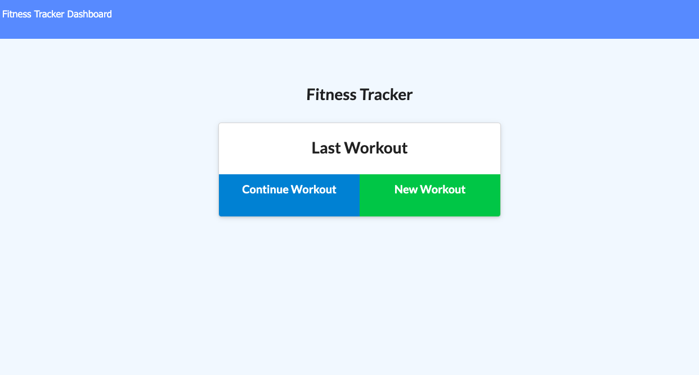

# Workout Tracker

## Table of Contents
* [Description](#description)
* [Usage](#usage)
* [Links](#links)
* [Screenshots](#screenshots)
* [Questions](#questions)

## Description
An application that helps track the users workouts. The application tracks cardio and resistance workouts using duration, weight, set, reps, and distance. The user can put a workout out in to complete later or one they have already completed. The user can use the dashboard to look at all workouts they have tracked and their stats.

## Usage
This application can be used to track and organize workouts to keep up with your weekly workouts and have your workout stats stored.

## Links
Github Repo: https://github.com/nataliegarcia-8/workout-tracker

Deployed Site: https://obscure-plains-26943.herokuapp.com/?id=5f7f22dd385afc0017ee7e6c

## Screenshots
home page:

workout page:

dashboard: 

## Questions 
### If you have any questions please contact me at:
Email: gnatalie.booking@gmail.com

Github: https://github.com/natalie-garcia-8